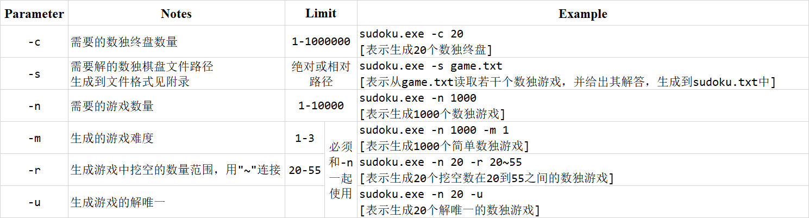

# 用户手册

&emsp;&emsp;能够使用这个软件，相信你已经了解数独的基本规则了！直接<br>进入软件的使用说明吧——

&emsp;&emsp;**可执行文件**在 Windows 10 命令行运行，通过指定一些参数实现数独的**求解**、**终局生成**、**游戏生成**。

&emsp;&emsp;在指定的任务结束后，显示“请按任意键继续. . .”，即`system("pause")`。

## 参数



注：
1. 同时使用-r和-m参数时，-m参数会被忽略。
1. 有多个相同参数时，参数以**最右侧**的为准。
2. 使用“-n”生成的**游戏**输出到可执行文件同目录下的 *problems.txt* 中。
2. 使用“-c”生成的**终局**输出到可执行文件同目录下的 *closing.txt* 中。
2. 使用“-s”生成的**解题结果**输出到可执行文件同目录下的 *sudoku.txt* 中。
1. 难度的衡量标准见 *附录* 。

## 环境要求
&emsp;&emsp;操作系统：Windows 10 x64
  
## 附录

### 棋盘文件样式
&emsp;&emsp;`$` 或者 `0` 表示空格，数字表示提示数字。

- 读入81个非空白符后，认为一个游戏输入结束。如：
```
$ $ 2 $ $ $ 3 5 1    7 9 $ $ $ $ $ $ $    $ $ $ $ 4 $ $ 9 8
$ 1 $ 4 5 $ 8 $ $    8 $ $ 1 $ $ $ $ 6    $ $ $ $ $ 9 $ $ $
6 $ $ $ 9 7 $ 2 $    $ $ $ $ $ $ 6 $ 5    $ 2 4 3 $ $ $ $ $
```
<table><tr><td> </td><td> </td><td>2</td><td> </td><td> </td><td> </td><td>3</td><td>5</td><td>1</td></tr><tr><td>7</td><td>9</td><td> </td><td> </td><td> </td><td> </td><td> </td><td> </td><td> </td></tr><tr><td> </td><td> </td><td> </td><td> </td><td>4</td><td> </td><td> </td><td>9</td><td>8</td></tr><tr><td> </td><td>1</td><td> </td><td>4</td><td>5</td><td> </td><td>8</td><td> </td><td> </td></tr><tr><td>8</td><td> </td><td> </td><td>1</td><td> </td><td> </td><td> </td><td> </td><td>6</td></tr><tr><td> </td><td> </td><td> </td><td> </td><td> </td><td>9</td><td> </td><td> </td><td> </td></tr><tr><td>6</td><td> </td><td> </td><td> </td><td>9</td><td>7</td><td> </td><td>2</td><td> </td></tr><tr><td> </td><td> </td><td> </td><td> </td><td> </td><td> </td><td>6</td><td> </td><td>5</td></tr><tr><td> </td><td>2</td><td>4</td><td>3</td><td> </td><td> </td><td> </td><td> </td><td> </td></tr></table>

- 类似地，游戏的解按 9×9 输出，实例如下：
```
4 6 2 9 7 8 3 5 1
7 9 8 5 3 1 4 6 2
3 5 1 6 4 2 7 9 8
2 1 3 4 5 6 8 7 9
8 7 9 1 2 3 5 4 6
5 4 6 7 8 9 2 1 3
6 3 5 8 9 7 1 2 4
9 8 7 2 1 4 6 3 5
1 2 4 3 6 5 9 8 7
```


### 难度

&emsp;&emsp;<span style="font-family:Times New Roman;font-weight:bold;">Def.</span> 根据当前数独状态，若存在一个空格，有且仅有一个数填入该空格后能符合数独要求，称此空格是唯一确定的。

&emsp;&emsp;不断填充唯一确定的空格，直至数独状态中找不到新的唯一确定空格时，正式开始计算难度。

&emsp;&emsp;拿到当前数独状态中每个空格的可能取值，以他们的平方和作为难度评分$D$。难度$M$与$D$关系如下：
$$
M = \left\{\begin{matrix}
 1, & 0 <= D < 256\\
 2, & 256 <= D < 512\\
 3, & D >= 512
\end{matrix}\right.
$$

<br>

---
### 软件性能测试
&emsp;&emsp;使用 AMD Ryzen 5 4600U with Radeon Graphics 测试
| 基准速度 | 内核 | 逻辑处理器 | L1缓存 | L2缓存 | L3缓存 |
|:--------:|:----:|:----------:|:------:|:------:|:------:|
| 2.10 GHz |   6  |     12     | 384 KB | 3.0 MB | 8.0 MB |

### 运行速度
- 生成 1000 个 55 空格的单解数独，约 1min 45s
- 解上面的生成的 1000 个数独，约 0.5s
- 生成 100,000 个终局，约 10.5s

---
### 项目信息

- 项目文件结构
```
Sudoku
├─ include
│    ├─ Board.h
│    ├─ Generator.h
│    └─ Solver.h
│
├─ src
│    ├─ Board.cpp
│    ├─ Generator.cpp
│    └─ Solver.cpp
│
└─ main.cpp
```

- 如果需要**手动编译**生成，在文件目录下执行如下编译命令：
```
g++ -Iinclude -o .\sudoku.exe .\main.cpp .\src\*.cpp
```
&emsp;&emsp;编译器：gcc 10.3.0

&emsp;&emsp;最低 C++ 标准：c++17

&emsp;&emsp;特别头文件：
<br>&emsp;&emsp;&emsp;&emsp;*\<chrono\>*
<br>&emsp;&emsp;&emsp;&emsp;*\<regex\>*
<br>&emsp;&emsp;&emsp;&emsp;*\<unistd.h\>*，需要其中的`getopt`函数

<!-- 
OpenCppCoverage.exe --sources D:\Coding\Software-Engineering-Sudoku\ --modules=D:\Coding\Software-Engineering-Sudoku\main.cpp  -- D:\Coding\Software-Engineering-Sudoku\sudoku.exe -->
