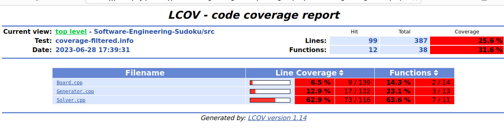

# 代码覆盖率
使用 `gcov` 和 `lcov`进行测试。
# 过程
我们针对程序的使用命令逐步进行测试。

**首先测试生成终局**
```shell
sudoku.exe -c 20
```
结果如下所示：

这里可以看到这个命令的代码覆盖率较低

仔细观察src的代码，发现覆盖率都不高

这里是由于我们的程序是集成的，因此在多个分支之间执行，必然会导致代码覆盖率较低

**然后测试解数独**
```shell
sudoku.exe -s game.txt
```


这里可以看出覆盖率有了一定的上升，同时solver的功能被覆盖最多。

我们仔细打开观察一下

这里我们发现，原来一些换行和括号并不会被gcov计算进去


**然后测试生成数独**
```shell
sudoku.exe -n 1000
```

这里我们发现头文件之中的函数原型都被调用了。

代码覆盖率也有了明显上升


**然后测试生成不同难度等级的数独**
```shell
sudoku.exe -n 1000 -m 3
```

可以发现代码覆盖率变得非常高，因为这几乎使用到了我们程序之中所需要和实现的大部分功能。

点开其中一个进行查看，可以发现几乎所有函数都被使用了。

**然后测试生成不同挖空数量的数独**
```shell
sudoku.exe -n 1000 -r 20-55
```

可以看到90%左右的代码覆盖率。

**最后测试生成唯一解的数独**
```shell
sudoku.exe -n 1000 -u
```

可以看到只有main.cpp的覆盖率与此前有所区别，其他的函数调用基本已经达到最多！

